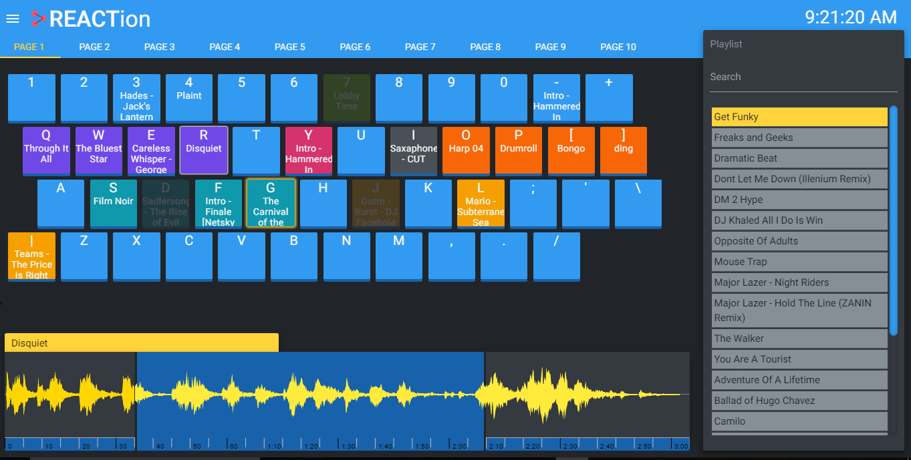

# REACTion

A free program that turns your keyboard into a soundboard!

## Latest Release
Latest Stable Release: v0.2.0

| Platform      | Download      |
| ------------- |:-------------:|
| Windows       | [32/64 bit](https://github.com/brandoshizzle/REACTion/releases/latest)   |
| OS X          | COMING SOON?   |
| Linux		      | COMING SOON?   |

## Basic Instructions

* Drag a sound onto a key or the playlist to add it to the program
* Press DELETE when a song is selected to delete it
* Click on a sound to load its waveform
* Right click on a sound to bring up its settings
* Drag the edges of the waveform to adjust sound start/end time (usually works, sometimes sound decides to play from beginning)
* Drag playlist items to reorder, drag sounds to different keys (on same page)
* Press space to play the first item of the playlist (highlighted in yellow)

## Changelog
See full Changelog [here](CHANGELOG.md)

## Known Issues (To address in future updates)
- Waveform doesn't track play progress if song was selected prior (you need to surprise the sound)
- Sometimes set start times don't work (fixed by selecting another sound, then playing it)
- Pages do not yet work

## 3rd party libraries

REACTion is lovingly built with these amazing projects:
* [Electron](http://electron.atom.io/)
* [Materialize](http://materializecss.com/)
* [jQuery](https://jquery.com/)
* [SoundJS](https://github.com/CreateJS/SoundJS)
* [wavesurfer.js](https://github.com/katspaugh/wavesurfer.js)
* [Jeditable](https://github.com/tuupola/jquery_jeditable)
* [Sortable](https://github.com/RubaXa/Sortable)

## License

Copyright 2017 Brandon Cathcart

Licensed under the Apache License, Version 2.0 (the "License");
you may not use this file except in compliance with the License.
You may obtain a copy of the License at

    http://www.apache.org/licenses/LICENSE-2.0

Unless required by applicable law or agreed to in writing, software
distributed under the License is distributed on an "AS IS" BASIS,
WITHOUT WARRANTIES OR CONDITIONS OF ANY KIND, either express or implied.
See the License for the specific language governing permissions and
limitations under the License.
